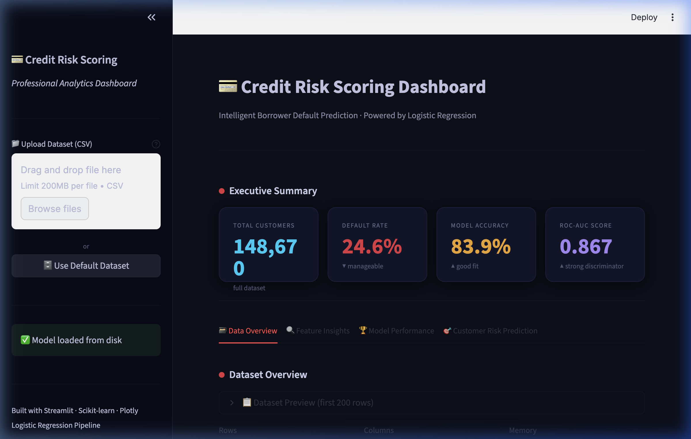
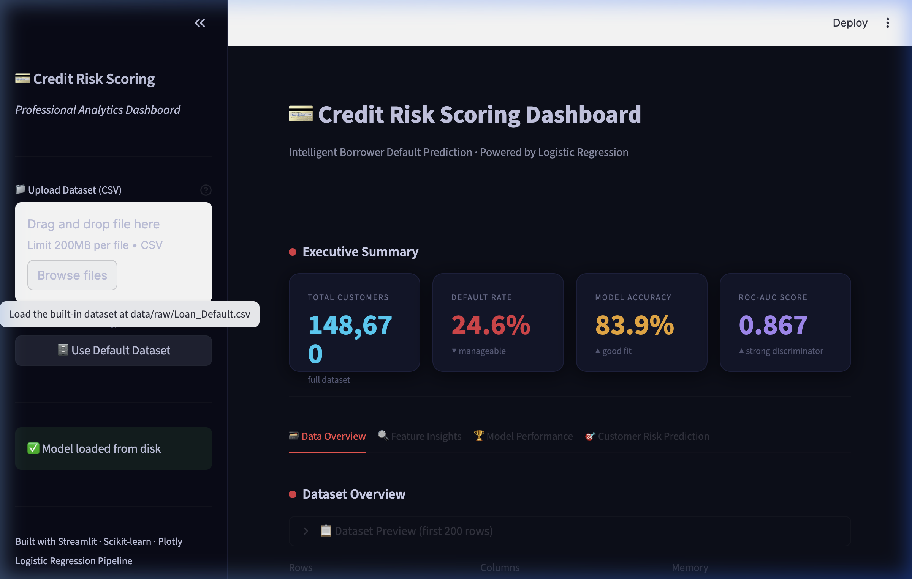
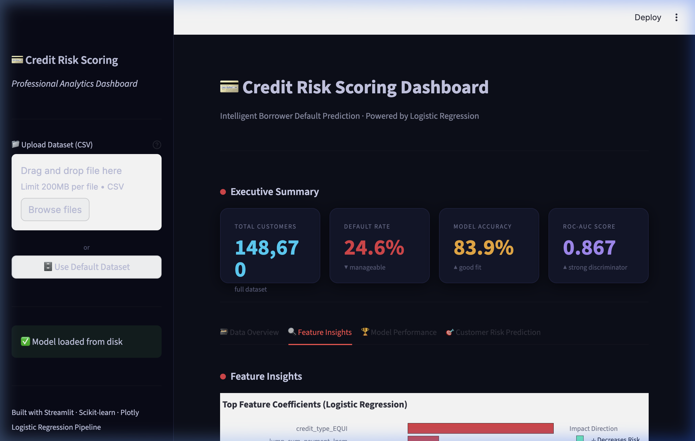
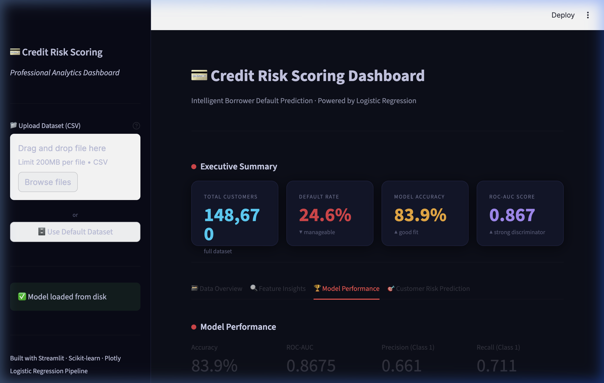
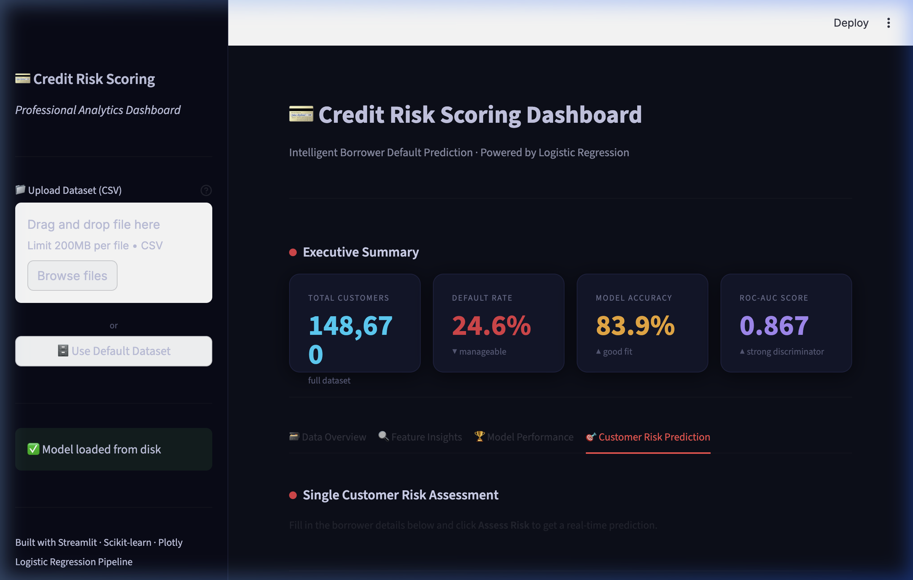

# 💳 Credit Risk Scoring Dashboard

### Mid-Semester Machine Learning Project — Intelligent Borrower Default Prediction



---

## 📌 Overview

This is a complete end-to-end Machine Learning project that predicts whether a borrower is likely to **default on a loan**. The project is deployed as an interactive, professional-grade analytics dashboard built with **Streamlit + Plotly**.

> **Milestone 1 (Mid-Sem)** — Classical ML only. No agent-based or LLM components.

---

## 📊 Live Dashboard — Key Metrics

| Metric | Value |
|---|---|
| 📦 Total Borrowers | **148,670** |
| ⚠️ Default Rate | **24.6%** |
| 🎯 Model Accuracy | **83.9%** |
| 📈 ROC-AUC Score | **0.867** |

These metrics are computed on a **20% held-out test split** (29,734 samples).

---

## 🖥️ Dashboard Screenshots

### 1️⃣ Executive Summary — KPI Cards

> Four real-time metric cards styled with per-card accent colors (cyan / red / gold / purple).


---

### 2️⃣ Data Overview — Churn Distribution

> Interactive Plotly donut chart showing **75.4% No Default** vs **24.6% Default** across 148,670 borrowers.



---

### 3️⃣ Data Overview — Pearson Correlation Heatmap

> Interactive correlation matrix revealing key relationships:
> - `loan_amount` ↔ `property_value` → **0.73** (strong positive)
> - `rate_of_interest` ↔ `Interest_rate_spread` → **0.61** (strong positive)
> - `income` ↔ `dtir1` → **−0.27** (negative — higher income = lower debt ratio)


---

### 4️⃣ Feature Insights — Logistic Regression Coefficients

> Top feature drivers of credit default, color-coded by direction:
> 🔴 Red = increases default risk | 🟢 Green = decreases default risk



**Key findings:**
- `credit_type_EQUI` has the **strongest positive** log-odds coefficient (~8.5)
- `lump_sum_payment_lpsm` significantly increases risk
- `credit_type_EXP`, `credit_type_CIB`, `credit_type_CRIF` → decrease risk

---

### 5️⃣ Model Performance — Confusion Matrix & ROC Curve

> AUC = 0.8675. The model correctly identifies 5,210 true defaults on the test set.



| | Predicted No Default | Predicted Default |
|---|---|---|
| **Actual No Default** | 19,732 ✅ | 2,674 ❌ |
| **Actual Default** | 2,118 ❌ | 5,210 ✅ |

---

### 6️⃣ Customer Risk Prediction Panel

> Real-time single-borrower risk scoring with a Plotly gauge chart and Low / Medium / High risk badge.



---

## 🔬 Problem Statement

Credit risk is a major concern for banks and financial institutions — loan defaults directly impact revenue and stability.

**Objectives:**
- Predict whether a borrower will default (binary classification)
- Output a calibrated default **probability score**
- Identify which features most influence credit risk
- Deliver insights through a professional web dashboard

---

## 🧠 Machine Learning Approach

I used **Logistic Regression** because:
- It is interpretable and widely used in financial risk
- It produces calibrated probability outputs
- Coefficients directly indicate feature impact direction
- Fast to train even on large datasets (148k+ rows)

### Preprocessing Pipeline

```
Raw CSV
  ↓ Drop ID column
  ↓ Numeric features  → Median imputation → StandardScaler
  ↓ Categorical features → Mode imputation → OneHotEncoder
  ↓ ColumnTransformer → Pipeline
  ↓ LogisticRegression(class_weight="balanced", max_iter=1000)
```

The `class_weight="balanced"` setting handles the **24.6% class imbalance** automatically.

---

## 📈 Model Evaluation

### Why ROC-AUC and not just Accuracy?

In credit risk, the dataset is imbalanced (~75% non-default). A naïve model that always predicts "No Default" gets **75% accuracy but 0% recall on defaults** — completely useless. ROC-AUC measures the model's ability to **rank** defaulters above non-defaulters regardless of threshold.

| Metric | Score |
|---|---|
| Accuracy | **83.9%** |
| ROC-AUC | **0.867** |
| Recall (Defaults) | Captured 5,210 / 7,328 defaults |
| False Negative Rate | 28.9% (2,118 missed defaults) |

---

## 🗂️ Dataset

**Source:** `Loan_Default.csv`

| Property | Value |
|---|---|
| Total Records | 148,670 |
| Features | 34 columns |
| Target Column | `Status` (0 = No Default, 1 = Default) |
| Class Balance | No Default: 75.4% / Default: 24.6% |

**Key features used:**
- `loan_amount`, `property_value`, `income` (numeric)
- `rate_of_interest`, `LTV`, `dtir1`, `Credit_Score` (numeric)
- `credit_type`, `loan_purpose`, `occupancy_type` (categorical)

---

## 🎨 Dashboard Features

| Section | Description |
|---|---|
| **Executive Summary** | 4 KPI cards — Customers, Default Rate, Accuracy, AUC |
| **Data Overview** | Missing value chart, default donut, histograms, correlation heatmap |
| **Feature Insights** | Logistic coefficients bar chart + boxplots by default status |
| **Model Performance** | Interactive confusion matrix, ROC curve, classification report |
| **Risk Prediction** | Real-time input form → probability gauge → Low/Medium/High badge |

---

## 🛠️ Technologies Used

| Layer | Tool |
|---|---|
| Language | Python 3.13 |
| ML | Scikit-Learn 1.8 (Logistic Regression) |
| Data | Pandas, NumPy |
| Visualization | **Plotly** (interactive), Matplotlib, Seaborn |
| Dashboard | **Streamlit 1.54** |
| Model Persistence | Joblib |

---

## 📁 Project Structure

```
Credit-Risk-Scoring/
│
├── app/
│   └── streamlit_app.py          # Full analytics dashboard (800+ lines)
│
├── data/
│   └── raw/
│       └── Loan_Default.csv      # 148,670 borrower records
│
├── models/
│   ├── logistic_model.pkl        # Trained sklearn Pipeline
│   └── feature_columns.pkl       # Saved feature column names
│
├── data/images/                  # Dashboard screenshots
│   ├── 01_executive_summary.png
│   ├── 02_data_overview.png
│   ├── 03_feature_insights.png
│   ├── 04_model_performance.png
│   └── 05_risk_prediction.png
│
├── notebooks/
│   └── EDA.ipynb                 # Exploratory Data Analysis
│
├── requirements.txt
├── README.md
└── .gitignore
```

---

## ▶️ How to Run Locally

```bash
# 1. Clone the repository
git clone https://github.com/RajAditya7777/Credit-Risk-Scoring
cd Credit-Risk-Scoring

# 2. Create virtual environment
python -m venv .venv
source .venv/bin/activate       # macOS/Linux
# .venv\Scripts\activate        # Windows

# 3. Install dependencies
pip install -r requirements.txt

# 4. Run the dashboard
streamlit run app/streamlit_app.py
```

Then open **http://localhost:8501** and either:
- Click **"🗄 Use Default Dataset"** in the sidebar to load the built-in data instantly
- Or upload your own CSV

---

## 🔑 Risk Category Logic

| Probability Range | Category | Colour | Action |
|---|---|---|---|
| 0% – 30% | 🟢 Low Risk | Mint | Approve loan |
| 30% – 60% | 🟠 Medium Risk | Gold | Additional review |
| 60% – 100% | 🔴 High Risk | Red | Decline / collateral required |

---

## 💡 What I Learned

- How to build a complete ML pipeline from raw CSV to deployed web app
- Why `class_weight="balanced"` is essential for imbalanced financial data
- How to interpret logistic regression coefficients as feature importance
- Why ROC-AUC is the right metric for credit risk (not accuracy)
- How to create professional Plotly interactive charts inside Streamlit
- How to use `@st.cache_resource` and `@st.cache_data` for performance

---

## 🔭 Conclusion

This project successfully demonstrates how classical Machine Learning solves a real-world financial problem. Starting from a raw 148,670-row borrower dataset, the pipeline produces an **83.9% accurate model with 0.867 AUC**, surfaced through a professional dark-themed analytics dashboard that any business stakeholder could use.

> *This forms the foundation for Milestone 2, where advanced models (ensemble methods, neural networks) and potentially agentic components will be explored.*
